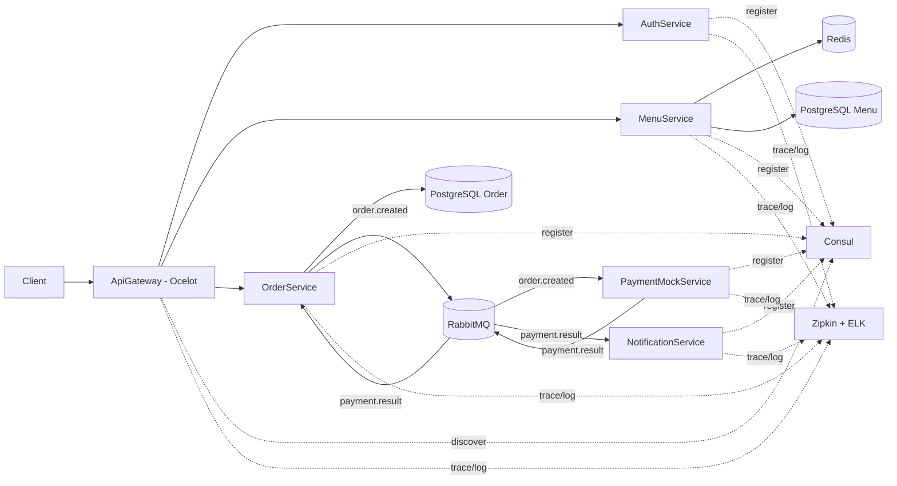

# Mini Food Ordering Microservices (.NET)


Dự án BTL microservices mô phỏng hệ thống đặt món ăn, tập trung vào đầy đủ các mảnh ghép kiến trúc hiện đại: gateway, discovery, auth, async messaging, cache, tracing và centralized logging.

## 1) Mục tiêu đồ án

- Xây hệ thống tách thành nhiều service độc lập.
- Có giao tiếp đồng bộ (`HTTP`) và bất đồng bộ (`RabbitMQ`).
- Có xác thực/ủy quyền (`JWT`).
- Có service discovery (`Consul`) và kiểm tra sức khỏe (`/health`).
- Có quan sát hệ thống (`OpenTelemetry + Zipkin`, `Serilog + ELK`).
- Chạy toàn bộ local bằng `Docker Compose`.

## 2) Kiến trúc tổng quan



## 3) Stack công nghệ

| Nhóm | Công nghệ |
|---|---|
| Backend | .NET 8 Minimal API |
| Gateway | Ocelot |
| Discovery | Consul |
| Message Broker | RabbitMQ |
| Database | PostgreSQL |
| Cache | Redis |
| Auth | JWT Bearer |
| Tracing | OpenTelemetry + Zipkin |
| Logging | Serilog + Elasticsearch + Kibana |
| Orchestration | Docker Compose |
| CI | GitHub Actions |

## 4) Microservices trong dự án

- `AuthService`: đăng ký/đăng nhập, cấp JWT.
- `MenuService`: quản lý menu, đọc cache Redis.
- `OrderService`: tạo đơn, publish `order.created`, cập nhật trạng thái từ `payment.result`.
- `PaymentMockService`: giả lập thanh toán, publish `payment.result`.
- `NotificationService`: consume `payment.result`, ghi log thông báo.
- `ApiGateway`: route request theo service discovery Consul.

## 5) Luồng nghiệp vụ chính

1. User login qua `/api/auth/login` để lấy JWT.
2. Admin tạo món qua `/api/menu`.
3. User tạo đơn qua `/api/orders`.
4. `OrderService` publish event `order.created`.
5. `PaymentMockService` consume và publish `payment.result`.
6. `OrderService` consume `payment.result` để đổi `PendingPayment -> Paid`.
7. `NotificationService` consume `payment.result` và ghi log.

## 6) Hướng dẫn chạy nhanh

Yêu cầu:
- Docker Desktop đang chạy.

Lệnh chạy:

```bash
docker compose up --build
```

Endpoints:

- Gateway: `http://localhost:5000`
- Auth Swagger: `http://localhost:5001/swagger`
- Menu Swagger: `http://localhost:5002/swagger`
- Order Swagger: `http://localhost:5003/swagger`
- Payment Swagger: `http://localhost:5004/swagger`
- Notification Swagger: `http://localhost:5005/swagger`
- Consul: `http://localhost:8500`
- RabbitMQ: `http://localhost:15672` (`guest/guest`)
- Zipkin: `http://localhost:9411`
- Kibana: `http://localhost:5601`

## 7) Demo API nhanh qua Gateway

### 7.1 Login admin

```bash
curl -X POST http://localhost:5000/api/auth/login \
  -H "Content-Type: application/json" \
  -d '{"username":"admin","password":"admin123"}'
```

### 7.2 Tạo món ăn (admin)

```bash
curl -X POST http://localhost:5000/api/menu \
  -H "Authorization: Bearer <TOKEN>" \
  -H "Content-Type: application/json" \
  -d '{"name":"Pho Bo","description":"Pho bo dac biet","price":50000}'
```

### 7.3 Tạo đơn hàng

```bash
curl -X POST http://localhost:5000/api/orders \
  -H "Authorization: Bearer <TOKEN>" \
  -H "Content-Type: application/json" \
  -d '{
    "items":[
      {
        "menuItemId":"11111111-1111-1111-1111-111111111111",
        "name":"Pho Bo",
        "quantity":2,
        "unitPrice":50000
      }
    ]
  }'
```

## 8) Mapping với yêu cầu môn học

- Gateway: Ocelot
- Discovery: Consul
- Message broker: RabbitMQ
- Database: PostgreSQL
- Cache: Redis
- Security: JWT
- Tracing: OpenTelemetry + Zipkin
- Logging: Serilog + Elasticsearch + Kibana
- Containerization: Docker Compose

## 9) CI/CD hiện có

Repo đã có GitHub Actions workflow:

- `.github/workflows/ci.yml`
- Trigger khi `push`/`pull_request` vào `main`
- Tự động `restore + build` từng project `.csproj`
- Validate cú pháp `docker-compose.yml`

## 10) Tài liệu học chi tiết

Xem tài liệu học đầy đủ tại:

- [docs/HOC_DU_AN_MICROSERVICES.md](docs/HOC_DU_AN_MICROSERVICES.md)

Tài liệu này có phần nâng cao: sequence diagram, troubleshooting, checklist demo bảo vệ, roadmap nâng cấp.

## 11) Postman collection (1-click demo)

Repo đã có sẵn file Postman:

- [postman/MiniFoodOrdering.postman_collection.json](postman/MiniFoodOrdering.postman_collection.json)
- [postman/MiniFoodOrdering.local.postman_environment.json](postman/MiniFoodOrdering.local.postman_environment.json)

Thứ tự chạy khuyên dùng trong Postman:

1. `Auth -> Login Admin` (tự lưu `accessToken`)
2. `Menu -> Create Menu Item (Admin)` (tự lưu `menuItemId`)
3. `Orders -> Create Order` (tự lưu `orderId`)
4. `Orders -> Get Order By Id`
