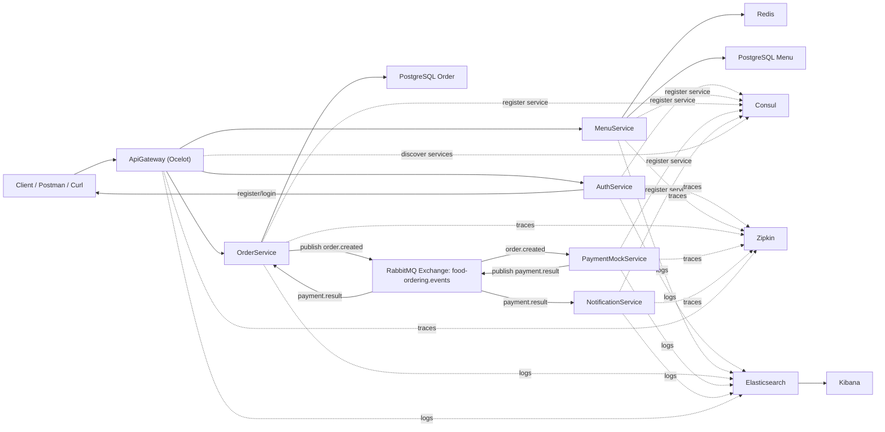
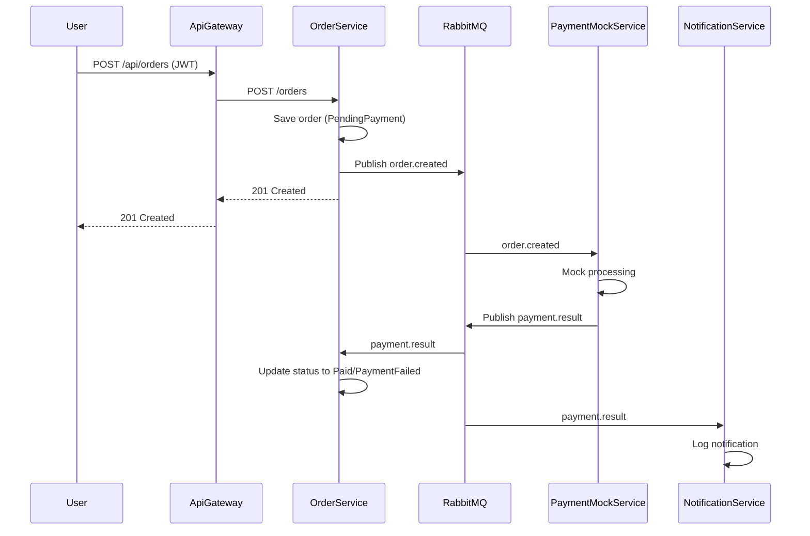

# Học Dự Án Mini Food Ordering Microservices (.NET)

Tài liệu này giúp bạn học dự án từ mức cơ bản đến mức tự tin demo/giải thích trước giảng viên.

## Mục lục nhanh

1. Mục tiêu dự án
2. Toàn cảnh kiến trúc
3. Cấu trúc source code
4. Công nghệ sử dụng và vai trò
5. Mô tả chi tiết từng service
6. Dữ liệu và schema
7. Event-driven communication
8. Bảo mật JWT
9. Quan sát hệ thống
10. Chạy dự án từ đầu
11. Thực hành API end-to-end
12. Sequence tạo đơn
13. Checklist demo
14. Lỗi thường gặp
15. Giới hạn hiện tại
16. Roadmap nâng cấp
17. Lộ trình học 7 ngày
18. Câu hỏi bảo vệ thường gặp
19. Lệnh debug hữu ích
20. Tóm tắt học nhanh

## 1) Mục tiêu dự án

Bạn đang xây một hệ thống đặt món ăn mini theo kiến trúc microservices với các mục tiêu chính:

- Tách nghiệp vụ thành nhiều service độc lập.
- Có giao tiếp đồng bộ (`HTTP` qua Gateway) và bất đồng bộ (`RabbitMQ` event bus).
- Có bảo mật `JWT`.
- Có service discovery (`Consul`) và health checks.
- Có observability: trace (`OpenTelemetry + Zipkin`) và log tập trung (`Serilog + Elasticsearch + Kibana`).
- Chạy local toàn bộ bằng `Docker Compose`.

## 2) Toàn cảnh kiến trúc

### 2.1 Thành phần chính

- `ApiGateway` (Ocelot): cổng vào duy nhất cho client.
- `AuthService`: đăng ký/đăng nhập, cấp JWT.
- `MenuService`: quản lý món ăn, cache danh sách menu bằng Redis.
- `OrderService`: tạo đơn, publish sự kiện `order.created`, consume `payment.result` để cập nhật trạng thái.
- `PaymentMockService`: consume `order.created`, mô phỏng thanh toán và publish `payment.result`.
- `NotificationService`: consume `payment.result`, ghi log thông báo.

### 2.2 Sơ đồ luồng tổng quan



## 3) Cấu trúc source code

```text
D:\PMDV
├─ docker-compose.yml
├─ README.md
├─ docs
│  └─ HOC_DU_AN_MICROSERVICES.md
└─ src
   ├─ ApiGateway
   ├─ AuthService
   ├─ MenuService
   ├─ OrderService
   ├─ PaymentMockService
   ├─ NotificationService
   └─ SharedContracts
```

## 4) Công nghệ sử dụng và vai trò

- `.NET 8 Minimal API`: xây service nhanh, ít boilerplate.
- `Ocelot`: API Gateway cho route + service discovery.
- `Consul`: registry và health check.
- `RabbitMQ`: event-driven communication.
- `PostgreSQL`: lưu dữ liệu bền vững cho menu và order.
- `Redis`: cache danh sách menu.
- `JWT`: xác thực/ủy quyền.
- `OpenTelemetry + Zipkin`: theo dõi trace xuyên service.
- `Serilog + Elasticsearch + Kibana`: log tập trung, tra cứu theo service.
- `Docker Compose`: chạy local toàn stack.

## 5) Mô tả chi tiết từng service

### 5.1 AuthService

Nhiệm vụ:

- Đăng ký người dùng (`/auth/register`).
- Đăng nhập (`/auth/login`) trả JWT có claim `sub` và `role`.

Lưu ý triển khai:

- User store hiện là in-memory (`ConcurrentDictionary`).
- Có admin mặc định:
  - `username`: `admin`
  - `password`: `admin123`
  - `role`: `admin`
- Password hash bằng SHA256 (mục tiêu demo học tập, không phải production-grade).

### 5.2 MenuService

Nhiệm vụ:

- `GET /menu`: đọc menu (ưu tiên Redis cache).
- `POST /menu`: tạo món mới (yêu cầu role `admin`).

Lưu ý triển khai:

- Cache key: `menu:all`, TTL 5 phút.
- Sau khi tạo món mới, cache bị xóa để lần đọc kế tiếp lấy dữ liệu mới từ DB.

### 5.3 OrderService

Nhiệm vụ:

- `POST /orders`: tạo order mới.
- `GET /orders/{id}`: lấy order theo user hiện tại.
- Publish event `order.created`.
- Consume event `payment.result` để đổi trạng thái đơn.

Trạng thái đơn:

- `PendingPayment`
- `Paid`
- `PaymentFailed`

### 5.4 PaymentMockService

Nhiệm vụ:

- Consume `order.created`.
- Mô phỏng xử lý thanh toán.
- Publish `payment.result` (hiện tại luôn thành công).

### 5.5 NotificationService

Nhiệm vụ:

- Consume `payment.result`.
- Ghi log thông báo thanh toán.

### 5.6 ApiGateway

Nhiệm vụ:

- Nhận toàn bộ request từ client.
- Route tới service đích theo `ServiceName` thông qua Consul.

Route chính:

- `/api/auth/*` -> `auth-service`
- `/api/menu*` -> `menu-service`
- `/api/orders*` -> `order-service`

## 6) Dữ liệu và schema

### 6.1 PostgreSQL (Menu DB)

Bảng `menu_items`:

- `id` (`Guid`, PK)
- `name` (`varchar(200)`, required)
- `description` (`varchar(1000)`, nullable)
- `price` (`numeric(10,2)`)
- `created_at` (`timestamp with time zone` theo mapping của EF)

### 6.2 PostgreSQL (Order DB)

Bảng `orders`:

- `id` (`Guid`, PK)
- `username` (`varchar(200)`, required)
- `status` (`varchar(64)`, required)
- `total_amount` (`numeric(10,2)`)
- `created_at`

Bảng `order_items`:

- `id` (`Guid`, PK)
- `order_id` (`Guid`, FK -> orders.id)
- `menu_item_id` (`Guid`)
- `name` (`varchar(200)`, required)
- `quantity` (`int`)
- `unit_price` (`numeric(10,2)`)

## 7) Event-driven communication

Exchange:

- `food-ordering.events` (topic, durable)

Routing keys:

- `order.created`
- `payment.result`

Queues:

- `paymentmock.order.created` (PaymentMockService consume)
- `orderservice.payment.result` (OrderService consume)
- `notificationservice.payment.result` (NotificationService consume)

### 7.1 Contract: OrderCreatedEvent

```json
{
  "orderId": "guid",
  "username": "string",
  "totalAmount": 100000,
  "createdAt": "2026-03-31T00:00:00Z",
  "items": [
    {
      "menuItemId": "guid",
      "name": "Pho Bo",
      "quantity": 2,
      "unitPrice": 50000
    }
  ]
}
```

### 7.2 Contract: PaymentResultEvent

```json
{
  "orderId": "guid",
  "isSuccess": true,
  "message": "Mock payment succeeded",
  "processedAt": "2026-03-31T00:00:01Z"
}
```

## 8) Bảo mật JWT

Luồng:

- User login qua `AuthService`, nhận `accessToken`.
- Gọi `MenuService`/`OrderService` qua Gateway với header:

```http
Authorization: Bearer <ACCESS_TOKEN>
```

Role-based authorization:

- `POST /api/menu` yêu cầu role `admin`.

Các endpoint order yêu cầu đăng nhập:

- `POST /api/orders`
- `GET /api/orders/{id}`

## 9) Quan sát hệ thống (Observability)

### 9.1 Tracing với Zipkin

- Mỗi service có `OpenTelemetry` và export trace đến Zipkin.
- Mở `http://localhost:9411`, chọn service để xem trace.

Mục tiêu khi demo:

- Một request tạo order phải thấy chuỗi trace qua `ApiGateway` -> `OrderService` và các xử lý liên quan.

### 9.2 Logging tập trung với ELK

- Mỗi service gửi log vào Elasticsearch qua Serilog.
- Mỗi service có index format riêng:
  - `authservice-logs-*`
  - `menuservice-logs-*`
  - `orderservice-logs-*`
  - `paymentservice-logs-*`
  - `notificationservice-logs-*`
  - `apigateway-logs-*`

Trong Kibana:

- Vào `Management -> Stack Management -> Data Views`.
- Tạo data view `*-logs-*`.
- Vào `Discover` để lọc theo service, level, message.

## 10) Chạy dự án từ đầu

### 10.1 Điều kiện cần

- Docker Desktop đang chạy.
- Có quyền dùng `docker` và `docker compose`.

Kiểm tra:

```bash
docker --version
docker compose version
```

### 10.2 Chạy toàn hệ thống

Tại thư mục `D:\PMDV`:

```bash
docker compose up --build
```

### 10.3 Endpoint sau khi chạy

- Gateway: `http://localhost:5000`
- Auth Swagger: `http://localhost:5001/swagger`
- Menu Swagger: `http://localhost:5002/swagger`
- Order Swagger: `http://localhost:5003/swagger`
- Payment Swagger: `http://localhost:5004/swagger`
- Notification Swagger: `http://localhost:5005/swagger`
- Consul UI: `http://localhost:8500`
- RabbitMQ UI: `http://localhost:15672` (`guest/guest`)
- Zipkin: `http://localhost:9411`
- Kibana: `http://localhost:5601`

### 10.4 Dừng hệ thống

```bash
docker compose down
```

Dừng và xóa luôn volume dữ liệu:

```bash
docker compose down -v
```

## 11) Thực hành API end-to-end

### 11.1 Bước 1: Login admin

```bash
curl -X POST http://localhost:5000/api/auth/login \
  -H "Content-Type: application/json" \
  -d "{\"username\":\"admin\",\"password\":\"admin123\"}"
```

Kết quả mẫu:

```json
{
  "accessToken": "<JWT>",
  "expiresAtUtc": "2026-03-31T09:00:00Z"
}
```

### 11.2 Bước 2: Tạo món ăn

```bash
curl -X POST http://localhost:5000/api/menu \
  -H "Authorization: Bearer <JWT>" \
  -H "Content-Type: application/json" \
  -d "{\"name\":\"Pho Bo\",\"description\":\"Pho bo dac biet\",\"price\":50000}"
```

### 11.3 Bước 3: Xem menu (kiểm tra cache)

```bash
curl http://localhost:5000/api/menu
```

Lần đầu thường trả `source = database`, lần sau có thể là `source = cache`.

### 11.4 Bước 4: Tạo order

```bash
curl -X POST http://localhost:5000/api/orders \
  -H "Authorization: Bearer <JWT>" \
  -H "Content-Type: application/json" \
  -d "{
    \"items\": [
      {
        \"menuItemId\": \"11111111-1111-1111-1111-111111111111\",
        \"name\": \"Pho Bo\",
        \"quantity\": 2,
        \"unitPrice\": 50000
      }
    ]
  }"
```

Lấy `id` từ response.

### 11.5 Bước 5: Kiểm tra order sau vài giây

```bash
curl -X GET http://localhost:5000/api/orders/<ORDER_ID> \
  -H "Authorization: Bearer <JWT>"
```

Kỳ vọng:

- Vừa tạo: `PendingPayment`
- Sau khi event xử lý: `Paid`

## 12) Sequence chi tiết cho nghiệp vụ tạo đơn



## 13) Checklist demo trước giảng viên

- Chứng minh tách service:
  - Mở `docker compose ps`.
  - Mở Consul thấy nhiều service riêng.
- Chứng minh sync call:
  - Gọi API qua Gateway.
- Chứng minh async flow:
  - Tạo order, theo dõi log `OrderService`, `PaymentMockService`, `NotificationService`.
- Chứng minh security:
  - Gọi `POST /api/menu` không token hoặc token user thường sẽ fail.
- Chứng minh cache:
  - `GET /api/menu` lần đầu `database`, lần sau `cache`.
- Chứng minh observability:
  - Zipkin có trace.
  - Kibana có log tập trung.

## 14) Lỗi thường gặp và cách xử lý

### 14.1 Docker daemon chưa chạy

Biểu hiện:

- Lỗi kiểu `dockerDesktopLinuxEngine not found`.

Cách xử lý:

- Mở Docker Desktop và đợi engine ready.
- Chạy lại `docker compose up --build`.

### 14.2 Service crash vì phụ thuộc lên chậm

Biểu hiện:

- Service restart vài lần lúc mới chạy.

Cách xử lý:

- Chờ thêm 10-30 giây.
- Dùng `docker compose logs -f <service>` để xem.
- Hệ thống đã có retry cho DB/RabbitMQ/Consul ở mức cơ bản.

### 14.3 Không thấy log trong Kibana

Kiểm tra:

- Elasticsearch có chạy không (`http://localhost:9200`).
- Kibana đã tạo data view `*-logs-*` chưa.

### 14.4 Không tạo được menu

Nguyên nhân:

- Token không phải role `admin`.

Cách xử lý:

- Login bằng `admin/admin123`.
- Hoặc register user role `admin` rồi login lại.

### 14.5 Order không chuyển trạng thái `Paid`

Kiểm tra:

- RabbitMQ UI có queue/exchange chưa.
- Log `PaymentMockService` có xử lý `order.created` chưa.
- Log `OrderService` có consume `payment.result` chưa.

## 15) Giới hạn hiện tại của dự án

- `AuthService` dùng in-memory users, restart là mất user mới đăng ký.
- Chưa có refresh token, revoke token, password policy.
- `PaymentMockService` hiện luôn thành công.
- Chưa có circuit breaker/retry policy cho HTTP downstream trong gateway.
- Chưa có test tự động (unit/integration/e2e).

## 16) Roadmap nâng cấp (nếu muốn ăn điểm cao hơn)

- Chuyển Auth sang DB thật (PostgreSQL) + refresh token.
- Thêm `PaymentFailed` ngẫu nhiên để demo thất bại.
- Thêm endpoint update/cancel order.
- Thêm outbox pattern để tăng độ tin cậy event publish.
- Thêm integration tests với `Testcontainers`.
- Thêm Prometheus + Grafana cho metrics.
- Triển khai K8s (nếu môn học yêu cầu nâng cao).

## 17) Lộ trình học dự án trong 7 ngày

Ngày 1:

- Chạy `docker compose up --build`.
- Mở tất cả dashboard (Consul, RabbitMQ, Zipkin, Kibana).

Ngày 2:

- Học `AuthService` + JWT.
- Gọi thử register/login bằng Postman hoặc curl.

Ngày 3:

- Học `MenuService` + Redis cache.
- Theo dõi khác biệt `source = database/cache`.

Ngày 4:

- Học `OrderService` + DB model.
- Tạo order và đọc lại theo `id`.

Ngày 5:

- Học event-driven: `order.created` -> `payment.result`.
- Theo dõi queue và log các service.

Ngày 6:

- Học observability:
  - Đọc trace trên Zipkin.
  - Truy vấn log trên Kibana.

Ngày 7:

- Tập demo 10-15 phút theo checklist mục 13.
- Chuẩn bị phần giải thích trade-off: vì sao chọn RabbitMQ, Ocelot, Consul.

## 18) Câu hỏi thường bị hỏi khi bảo vệ

1. Vì sao phải dùng Gateway thay vì gọi thẳng service?
2. Service discovery giải quyết vấn đề gì?
3. Vì sao cần queue, không gọi PaymentService trực tiếp?
4. Cache Redis giúp gì cho hiệu năng?
5. Khác nhau giữa log và trace là gì?
6. Nếu Payment service chết thì hệ thống xử lý thế nào?
7. Dự án hiện tại thiếu gì để đưa production?

Bạn nên chuẩn bị câu trả lời ngắn gọn cho từng câu trên.

## 19) Lệnh debug hữu ích

Xem trạng thái container:

```bash
docker compose ps
```

Xem log 1 service:

```bash
docker compose logs -f orderservice
```

Vào RabbitMQ UI:

- URL: `http://localhost:15672`
- User/Pass: `guest/guest`

Kiểm tra Consul service:

```bash
curl http://localhost:8500/v1/agent/services
```

## 20) Tóm tắt để học nhanh

- Đây là hệ thống microservices hoàn chỉnh mức đồ án, đủ các mảng quan trọng: API Gateway, Discovery, Auth, DB, Cache, Message Broker, Tracing, Logging.
- Luồng quan trọng nhất cần nắm chắc: `POST /api/orders` -> publish `order.created` -> Payment mock xử lý -> publish `payment.result` -> order đổi trạng thái -> notification log.
- Nếu bạn demo trơn tru checklist mục 13 và trả lời tốt mục 18, khả năng bảo vệ tốt là rất cao.
