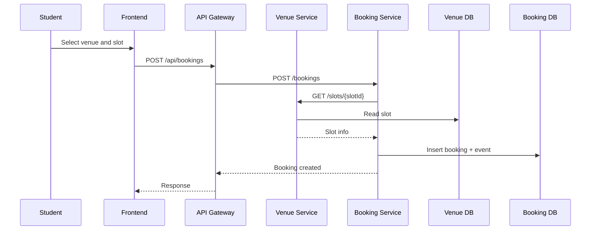

# CampusCourt - Analysis and Service-Oriented Design

## 1. Problem Statement

- Domain: Campus sports operations (education sector)
- Problem: Students spend time messaging staff manually to check court availability and register bookings. This causes schedule overlap and poor visibility.
- Users/Actors:
  - Student: browse venues, pick slots, create/cancel bookings
  - Sports Center Staff: add/update venues and operating slots
- Scope:
  - In scope: venue listing, slot visibility, booking lifecycle, cancellation, conflict prevention
  - Out of scope: payment gateway, advanced identity federation, QR check-in

## 2. Service-Oriented Analysis

### 2.1 Business Process Decomposition

| Step | Activity | Actor | Description |
|------|----------|-------|-------------|
| 1 | Browse venues | Student | User sees available courts by sport and location |
| 2 | View slots by date | Student | User checks slot availability for a chosen venue |
| 3 | Submit booking request | Student | User chooses slot and submits booking |
| 4 | Validate slot | Booking Service | Service verifies slot exists and is open |
| 5 | Persist booking | Booking Service | Booking is stored, event is recorded |
| 6 | Cancel booking (optional) | Student | User cancels booking if schedule changes |

### 2.2 Entity Identification

| Entity | Attributes | Owned By |
|--------|------------|----------|
| Venue | id, name, location, sport, capacity, createdAt | Service A |
| TimeSlot | id, venueId, startTime, endTime, status | Service A |
| Booking | id, slotId, venueId, userId, status, cancelReason, createdAt, updatedAt | Service B |
| BookingEvent | id, bookingId, eventType, payload, createdAt | Service B |

### 2.3 Service Candidate Identification

- Service A (Venue Service): bounded context for inventory of venues and slots.
- Service B (Booking Service): bounded context for transactional booking lifecycle and event trail.
- API Gateway: utility service for routing and external interface simplification.

## 3. Service-Oriented Design

### 3.1 Service Inventory

| Service | Responsibility | Type |
|---------|----------------|------|
| Venue Service (A) | Venue + slot management, slot lookup | Entity |
| Booking Service (B) | Booking create/read/cancel, conflict prevention, events | Task + Entity |
| API Gateway | Centralized API routing + CORS | Utility |

### 3.2 Service Capabilities

#### Service A

| Capability | Method | Endpoint | Input | Output |
|------------|--------|----------|-------|--------|
| Health check | GET | `/health` | - | `{status}` |
| List venues | GET | `/venues` | - | Venue[] |
| Create venue | POST | `/venues` | VenueCreate body | Venue |
| List slots by venue/date | GET | `/venues/{venueId}/slots` | venueId, date? | TimeSlot[] |
| Get slot by id | GET | `/slots/{slotId}` | slotId | TimeSlot |

#### Service B

| Capability | Method | Endpoint | Input | Output |
|------------|--------|----------|-------|--------|
| Health check | GET | `/health` | - | `{status}` |
| Create booking | POST | `/bookings` | BookingCreate body | Booking |
| Get booking details | GET | `/bookings/{bookingId}` | bookingId | Booking + events |
| Cancel booking | DELETE | `/bookings/{bookingId}` | bookingId, reason? | Booking |

### 3.3 Service Interactions

### 3.4 Data Ownership & Boundaries

| Data Entity | Owner Service | Access Pattern |
|-------------|---------------|----------------|
| Venue, TimeSlot | Service A | CRUD/read through Service A APIs |
| Booking, BookingEvent | Service B | CRUD/read through Service B APIs |

## 4. API Specifications

- `docs/api-specs/service-a.yaml`
- `docs/api-specs/service-b.yaml`

## 5. Data Model

### Service A

- `venues(id PK, name, location, sport, capacity, created_at)`
- `time_slots(id PK, venue_id FK->venues.id, start_time, end_time, status, created_at)`

### Service B

- `bookings(id PK, slot_id, venue_id, user_id, status, cancel_reason, created_at, updated_at)`
- `booking_events(id PK, booking_id FK->bookings.id, event_type, payload, created_at)`

## 6. Non-Functional Requirements

| Requirement | Description |
|-------------|-------------|
| Performance | Typical read APIs under 200ms in local Docker environment |
| Scalability | Service A and B can be scaled independently behind gateway |
| Availability | Health endpoints and DB readiness checks enable quick failure detection |
| Security | Input validation at API layer, CORS managed in gateway |
| Consistency | Unique index on active slot bookings prevents double-booking |
