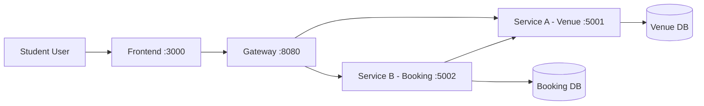

# CampusCourt - System Architecture

## 1. Overview

CampusCourt provides a booking platform for campus sports facilities.
The system focuses on clean service boundaries, simple deployment, and prevention of booking conflicts.

## 2. Architecture Style

- [x] Microservices
- [x] API Gateway pattern
- [ ] Event-driven / Message queue
- [ ] CQRS / Event Sourcing
- [x] Database per service
- [ ] Saga pattern
- [x] REST synchronous communication

## 3. System Components

| Component | Responsibility | Tech Stack | Port |
|-----------|----------------|-----------|------|
| Frontend | Student dashboard UI | HTML/CSS/JavaScript + Nginx | 3000 |
| Gateway | API entrypoint, routing, CORS | Node.js + Express + http-proxy-middleware | 8080 |
| Service A | Venue + slot management | Node.js + Express + PostgreSQL | 5001 |
| Service B | Booking workflow + events | Node.js + Express + PostgreSQL | 5002 |
| Venue DB | Persistent data for service-a | PostgreSQL 16 | internal |
| Booking DB | Persistent data for service-b | PostgreSQL 16 | internal |

## 4. Communication Patterns

- Frontend to Gateway: REST over HTTP
- Gateway to Services: internal REST over Docker network
- Service B to Service A: internal REST (`GET /slots/{slotId}`)
- Data storage: each service owns a separate PostgreSQL container

### Inter-service Communication Matrix

| From -> To | Service A | Service B | Gateway | Venue DB | Booking DB |
|------------|-----------|-----------|---------|----------|------------|
| Frontend | | | REST | | |
| Gateway | REST | REST | | | |
| Service A | | | | SQL | |
| Service B | REST | | | | SQL |

## 5. Data Flow

1. Student loads venues from frontend.
2. Frontend calls `GET /api/venues` via gateway.
3. Student picks slot and submits booking.
4. Gateway forwards `POST /api/bookings` to booking service.
5. Booking service verifies slot in venue service.
6. Booking service stores booking + event if slot remains available.

## 6. Architecture Diagram

## 7. Deployment

- Each component runs in its own Docker container.
- Orchestrated by Docker Compose.
- Startup command: `docker compose up --build`

## 8. Scalability and Fault Tolerance

- Service A and B can be scaled independently according to load profile.
- Database readiness health checks prevent premature service startup.
- Gateway isolates frontend from internal topology changes.
- Booking consistency is protected by a unique partial index on active slot bookings.
